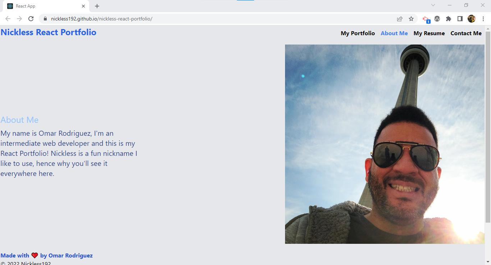

# Nickless React Portfolio

## Description

This project was bootstrapped with [Create React App](https://github.com/facebook/create-react-app).

This portfolio was created to showcase my knowledge of React. showcasing the finished application on a deployed GitHub page. This application is composed of the following components:

- About
- Contact
- Footer
- Header
- Navigation
- Project
- Resume

## Installation

In order to use this project, make sure to sure 'npm install' to obtain the appropriate npm modules that allow for the execution of the application. Please also make sure to read this entire README.md file for all additional information.

## Usage

To start the execution of the application local, type 'npm start' which will set your server to listen on port 3001. At this point, navigate to

```
http://localhost:3000/
```

to start using the application.

Screenshots of the application are shown below:




## Contribute

To contribute to this project, please fork it from the GitHub repository and when the pull request is sent, our team will work on merging the changes as needed/appropriate.

GitHub Repository Link: https://github.com/nickless192/nickless-react-portfolio

Link to deploed site: https://nickless192.github.io/nickless-react-portfolio/

## Testing

At the moment, no testing is set up for this project. Please visit us soon for more updates on testing.

## License

This project is covered under the MIT license agreement.

## Questions

Find my GitHub profile at https://github.com/nickless192.

## Contributors

Made with ❤️ by Nickless192 (Omar Rodriguez)